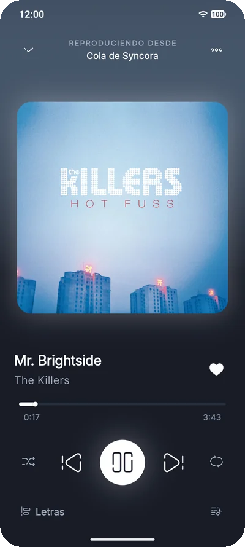
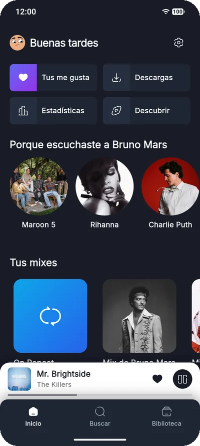
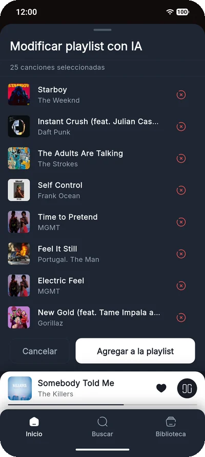
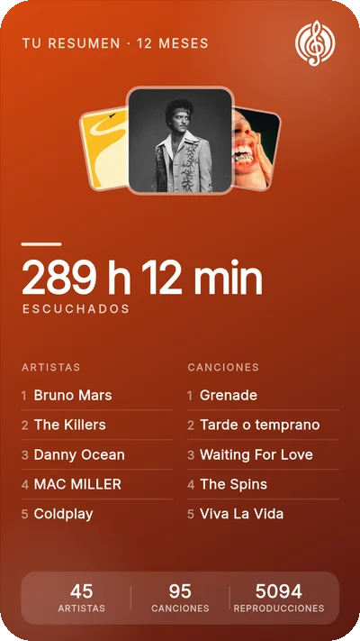
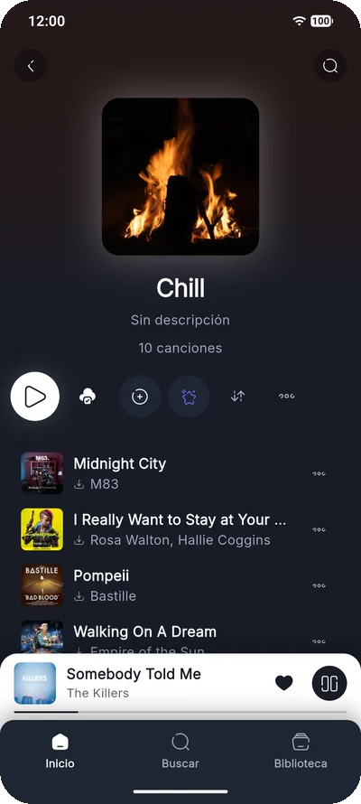
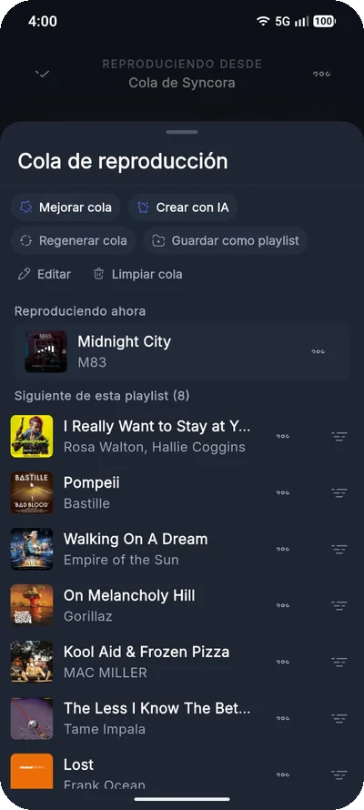
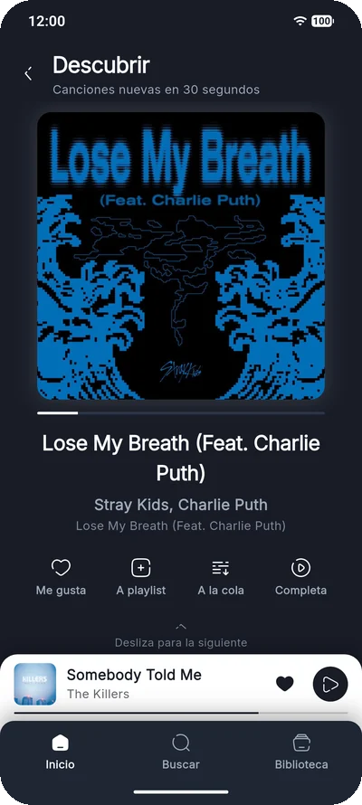
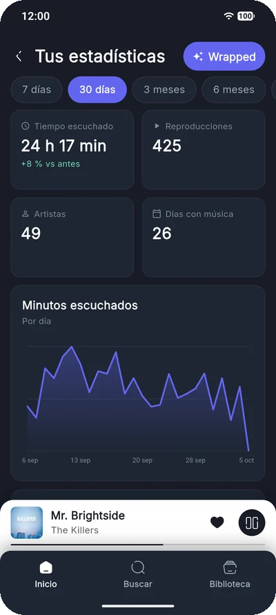
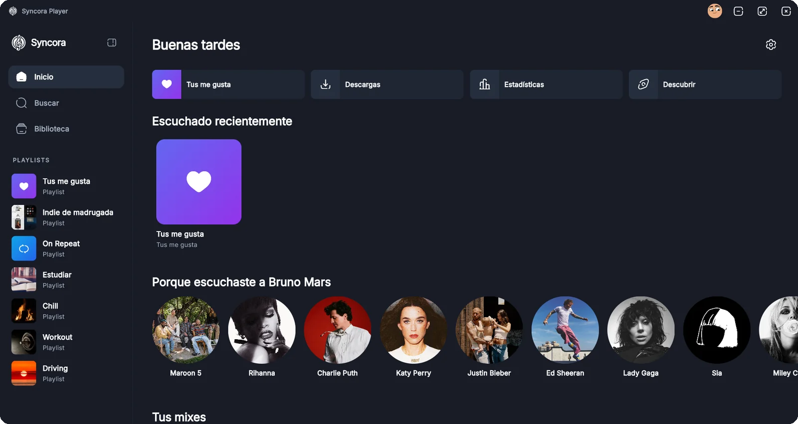

<div align="center">


# Syncora Player

**A free, open-source music player for Android and Windows.**

*No ads, no subscriptions, no account required.*

<a href="https://github.com/NotJcao17/syncora-player/releases/latest/download/Syncora.apk"></a>
<a href="https://github.com/NotJcao17/syncora-player/releases/latest/download/SyncoraSetup.exe"></a>
<a href="https://syncoraplayer.app"></a>

<sub>Android 7.0 or newer · Windows 10/11 (64-bit) · <a href="https://github.com/NotJcao17/syncora-player/releases">All releases</a></sub>


[](https://github.com/NotJcao17/syncora-player/releases/latest)
[](https://github.com/NotJcao17/syncora-player/releases)
[](https://syncoraplayer.app)
[](https://flutter.dev)
[](LICENSE)

<br>

&nbsp;
&nbsp;
&nbsp;


</div>

---

## What is Syncora Player?

Syncora Player is a native music player for **Windows and Android**. Metadata, artwork and the
catalog come from the public Deezer API; audio is resolved on the user's own device from public
sources by a self-updating extraction engine. Your library lives on the device (SQLite) and,
optionally, in the cloud (Supabase) to sync it across devices.

The core philosophy: **privacy-first, open source, polished design, zero cost to the user.**

> **A note on scale:** Syncora is a non-commercial hobby project running entirely on free-tier
> infrastructure. Streaming, downloads and the fully offline **no-account mode are unlimited** for
> everyone. Cloud accounts (sync across devices and the AI features) are capped at the **first 250
> signups** to stay inside the free database tier; the cap can be raised at any time without a
> redeploy.

---

## 📸 Screenshots

<div align="center">

&nbsp;
&nbsp;
&nbsp;


<br><br>



<sub>Screenshots use a demo account with sample data.</sub>

</div>

---

## 📥 Install

| Platform | Download | Notes |
| :--- | :--- | :--- |
| **Android** 7.0+ | [`Syncora.apk`](https://github.com/NotJcao17/syncora-player/releases/latest/download/Syncora.apk) | Allow installing apps from unknown sources when Android asks. |
| **Windows** 10/11 (64-bit) | [`SyncoraSetup.exe`](https://github.com/NotJcao17/syncora-player/releases/latest/download/SyncoraSetup.exe) | If SmartScreen warns, choose *More info → Run anyway* (the installer is not code-signed). |

Updates install over the previous version and keep your library. Privacy notice and terms:
[syncoraplayer.app](https://syncoraplayer.app).

---

## ✨ Features

### Listening
- 🎵 **Stream** any song in the Deezer catalog, no account needed.
- 📥 **Downloads** for offline playback, with selectable quality, per song, album or playlist.
- 🔀 Normal, shuffle and repeat (all / one), with **gapless** playback.
- 🌊 **Crossfade** (off / 2 / 4 / 6 s) between downloaded songs when one ends naturally.
- 📜 **Synced lyrics** (LRCLib) that follow the song; scroll freely and tap *Sync* to jump back.
- 🔁 **Dual queue**: a manual queue ("Play next" / "Add to queue", always first) on top of an
  automatic queue built from what you are playing. Drag to reorder, swipe to remove or queue.
- 📻 **Endless radio**: when the queue runs low it refills itself with similar songs (no AI).
- ✨ **Improve queue**: one tap mixes fresh recommendations into the queue, Smart-Shuffle style.
- 😴 Sleep timer.
- 🔔 Native OS controls: Android notification and lock screen (with like and shuffle buttons),
  **Android Auto**, and Windows media controls (SMTC).

### Library
- 📚 Playlists and saved albums, **pinning**, **folders**, sorting, list or grid view.
- ❤️ "Your likes" and "On Repeat" (refreshed every week from what you play the most).
- 🖼️ Custom playlist covers (image, color or gradient) and profile photo.
- 🗂️ **Import** playlists from a CSV or text file: a TuneMyMusic or Soundiiz export (so Spotify,
  Apple Music, Amazon Music, YouTube Music, Tidal… anything those tools can read), an Exportify
  export of Spotify, or plain `Artist - Title` lines. Runs in the background, survives closing the
  app, and matches the original artist and album.
- 📤 **Export** any playlist to CSV.
- Limits: playlist names up to 100 characters, descriptions up to 300, 10 000 songs per playlist.

### Discovery
- 🏠 Home: weekly summary, recently played, quick access, daily mixes, new releases from your
  artists, country charts, Deezer editorial playlists and **playlists for every moment**
  (party, workout, focus…).
- 🔎 Search songs, artists, albums and **ready-made Deezer playlists**, plus 27 genres, an exact
  search and a "search deeper in the discography" mode.
- 🎤 Artist pages with popular songs, discography, **"This is {artist}"** (their most played songs,
  only theirs) and **artist radio**.
- 🃏 **Discover**: a feed of 30-second previews to find new music fast.
- 📊 **Stats and Wrapped**: weekly, monthly, yearly and all-time listening, top songs, artists and
  genres, listening habits, and shareable story cards.

### AI (Gemini, cloud account)
- 💬 **Create a playlist** from a text prompt, with optional count, genre, mood, "known hits vs.
  discoveries" and "based on one of my playlists", and refine the draft before saving.
- 🎧 **Create a queue** from a text prompt (it goes to the manual queue).
- ✏️ **Edit a playlist** with natural language ("remove the slow ones", "add more 2000s rock").
- 🔍 **Find a song from a lyric fragment.**
- 🔑 **BYOK**: bring your own Google AI Studio key for unlimited use. AI suggestions are always
  matched against the Deezer catalog before anything is saved, and the server never writes to
  your library.

### Accounts and privacy
- 📴 **Use it without an account**, fully local, forever.
- ☁️ Optional account (Google or email) to sync your library across devices.
- 🗑️ Delete your account and cloud data from the app at any time.

---

## 🛠️ Tech Stack

| Layer | Android | Windows |
| :--- | :--- | :--- |
| **Framework** | Flutter (Dart), Riverpod, GoRouter | ← Same |
| **Audio** | `just_audio` (ExoPlayer) + `audio_service` | `media_kit` (libmpv) + `smtc_windows` |
| **Extraction** | `youtubei.js` in QuickJS (`flutter_js`) on a dedicated isolate | ← Same |
| **Metadata** | Deezer API | ← Same |
| **Lyrics** | LRCLib | ← Same |
| **Local data** | Drift (SQLite) | ← Same |
| **Cloud / Auth** | Supabase (PostgreSQL, Auth, Edge Functions) | ← Same |
| **Images** | Cloudflare R2 behind a Worker (custom covers and photos) | ← Same |
| **AI** | Google Gemini through a Supabase Edge Function | ← Same |

---

## 🔩 Extraction Engine

The engine turns a song (title, artist, duration) into a playable audio URL, entirely on the
user's device and IP. It is a single JavaScript bundle (polyfills + `youtubei.js` + glue code)
that runs inside QuickJS on its own Dart isolate, so the UI never stutters.

```
Player ──extractUrl──▶ ExtractionService ──▶ Extraction isolate (QuickJS)
                                                 │  polyfills.js  (fetch → Dart, URL, TextEncoder…)
                                                 │  youtubei.js   (public Innertube client)
                                                 │  glue.js       (search, match, format choice)
                                                 ▼
                                   DartFetchBridge (native HTTP: redirects, cookies, gzip/br)
```

- **Over-the-air updates.** CI rebuilds the engine when a new `youtubei.js` is published (after a
  24-hour quarantine), tests it in real QuickJS, signs it with **Ed25519** and publishes it to
  GitHub Releases. The app verifies the signature before running anything and only switches to a
  downloaded engine **if the current one stops working**; it can roll back and honours
  revocations. Details: [`docs/fases/fase_8.md`](docs/fases/fase_8.md).
- **Client hierarchy** (`engine/engine.config.json`) travels inside the engine, so a change in
  which Innertube clients work does not need an app update.
- **Loop protection.** A song that fails because of the network or a 403 gets exactly one retry;
  then playback pauses instead of hammering the server. A broken engine pauses playback without
  marking songs as unavailable.
- **Matching.** Songs are matched by title, artist and duration (`YtSearchMatcher`); see
  [`docs/fuentes_youtube_y_matching.md`](docs/fuentes_youtube_y_matching.md).

| Upstream change | Fixed by an OTA engine update? | App update needed? |
| :--- | :---: | :---: |
| Signature algorithms (`n-sig`, decipher) | ✅ | No |
| PoToken / client policy changes | ✅ (mostly) | No — the client list ships with the engine |
| New Web APIs needed by the library | ✅ (polyfills ship with the engine) | Only if a new Dart bridge is needed |
| Native player / HTTP header policies | ❌ | Yes |

---

## 🏗️ Project Structure

```
syncora-player/
├── engine/                     # Extraction engine sources, build, signing and tests (Node)
│   ├── src/                    #   polyfills.js, glue.js
│   ├── vendor/                 #   compiled youtubei.js
│   └── engine.config.json      #   Dart contract version + Innertube clients
├── assets/js/                  # Factory engine bundled with the app (built from engine/)
├── lib/
│   ├── core/                   # Extraction, cache, layout, navigation, theme, shared widgets
│   ├── data/                   # Deezer/LRCLib APIs, Drift database, Supabase repositories, sync
│   └── features/               # auth, catalog, discover, download, home, library, player,
│                               # profile, search, settings, stats
├── supabase/
│   ├── migrations/             # Database schema, RLS, triggers and RPCs
│   └── functions/              # Edge Functions: ai-assistant, user-images
├── cloudflare/image-worker/    # Worker that serves custom covers and photos from R2
├── .github/workflows/          # Engine publishing, canary and keep-alive jobs
├── test/                       # Unit and widget tests
└── docs/                       # Architecture notes, pitfalls, per-phase notes, manual test matrix
```

---

## 🚀 Getting Started (Development)

### Prerequisites
- [Flutter SDK](https://docs.flutter.dev/get-started/install) 3.x
- Android device or emulator (API 24+ / Android 7.0) **or** Windows 10+
- Node.js 20+ only if you want to rebuild the extraction engine

### Setup

```bash
git clone https://github.com/NotJcao17/syncora-player.git
cd syncora-player
flutter pub get
cp .env.example .env        # SUPABASE_URL and SUPABASE_ANON_KEY (both public by design)
flutter run -d windows      # or: flutter run -d <android-device-id>
```

Without a Supabase project the app still works in no-account mode.

### Release builds

Release builds **must** pass `--no-tree-shake-icons`:

```bash
flutter build apk --release --no-tree-shake-icons
flutter build windows --release --no-tree-shake-icons
```

The Solar icons are built at runtime with `IconData(codePoint, fontFamily: ...)` (see
`lib/core/theme/app_icons.dart`), which Flutter's icon tree shaker cannot analyse, so without the
flag the build stops with *"Avoid non-constant invocations of IconData"*. Release builds also shrink
Android resources: drawables that are only referenced by name from Dart (the notification's like and
shuffle icons) are kept by `android/app/src/main/res/raw/keep.xml`; a new one must be added there or
the notification disappears in release only. See Pitfall #32 in `docs/investigacion_y_pitfalls.md`.

### Tests

```bash
flutter analyze
flutter test                        # full suite
cd engine && npm ci && npm run check   # engine contract test in real QuickJS
```

### Testing Android Auto

Install the Android Auto app on the phone, open its settings, tap the version number ten times to
enable developer mode, turn on **Unknown sources**, and connect to a car or to the
[Desktop Head Unit](https://developer.android.com/training/cars/testing/dhu).

---

## ⚠️ Security Notice & False Positive Alert

> **GitHub Secret Scanning:** the bundled engine (`engine/vendor/youtubei.bundle.js` and
> `assets/js/`) contains the public string `AIzaSyAO_...`, which automated tools may flag as a
> "Google API Key". It is a **false positive**: YouTube's public web client key, embedded in
> open-source YouTube client libraries. It grants no access to private resources or accounts.

---

## ⚖️ Legal Disclaimer

Syncora Player and its contributors **do not host, own, or distribute** any copyrighted audio
content. The app is a client: catalog metadata comes from the public Deezer API, lyrics from
LRCLib, and audio is resolved from public sources on each user's own device at playback or download
time. All songs, recordings, artwork, lyrics and trademarks remain the property of their respective
owners and are protected by applicable copyright laws.

Downloads are meant for offline listening inside the app, for personal, non-commercial use. Users
are solely responsible for ensuring that their use of the app complies with local laws, copyright
regulations, and the terms of service of the respective content providers. The developers do not
encourage or endorse copyright infringement and assume no liability for misuse of the software.

Full terms (Spanish): [syncoraplayer.app/terminos](https://syncoraplayer.app/terminos/) ·
Privacy notice: [syncoraplayer.app/privacidad](https://syncoraplayer.app/privacidad/) ·
Contact: contacto@syncoraplayer.app

---

## 🙏 Credits

Syncora Player stands on the work of others. Thank you:

| Project | What it does in Syncora | License |
| :--- | :--- | :--- |
| [youtubei.js](https://github.com/LuanRT/YouTube.js) by LuanRT and contributors | Audio extraction engine | MIT |
| Solar Icons by 480 Design, via [flutty_solar_icons](https://pub.dev/packages/flutty_solar_icons) | App icons | CC BY 4.0 (icons) · MIT (package) |
| [DiceBear](https://www.dicebear.com) · [Adventurer Neutral](https://www.dicebear.com/styles/adventurer-neutral/) by Lisa Wischofsky | Default avatars | CC BY 4.0 (style) · MIT (DiceBear) |
| [Deezer API](https://developers.deezer.com) | Catalog metadata, artwork and previews | Deezer API terms |
| [LRCLib](https://lrclib.net) | Synced lyrics | Open community database |
| [Google Gemini](https://ai.google.dev) | AI features | Google API terms |
| [Supabase](https://supabase.com) | Accounts and cloud sync | Apache 2.0 (platform) |
| [Inter](https://fonts.google.com/specimen/Inter) by Rasmus Andersson | Typography | SIL OFL 1.1 |
| Flutter, Dart and the open-source packages in `pubspec.yaml` (just_audio, media_kit/libmpv, Drift/SQLite, flutter_js/QuickJS, Riverpod, …) | Everything else | See each package; listed in-app under *Settings → Credits → Open source licenses* |

Syncora is not affiliated with YouTube, Google, or Deezer.

---

## 📄 License

Copyright (C) 2026 **Juan Carlos Orozco**.

Syncora Player is free software: you can redistribute it and/or modify it under the terms of the
**[GNU General Public License v3.0](https://www.gnu.org/licenses/gpl-3.0)** as published by the
Free Software Foundation. It is distributed in the hope that it will be useful, but **without any
warranty**. See [LICENSE](LICENSE) for the full text.

In short: anyone may use, study, share and modify Syncora, but any distributed version — modified
or not — must stay under the GPL v3, keep the original copyright notice crediting Juan Carlos
Orozco, and ship its source code. Closed-source forks are not allowed.

Third-party components listed in [Credits](#-credits) keep their own licenses.

---

<div align="center">
  Built with ❤️ using Flutter · Created by <b>Juan Carlos Orozco Nieto</b> · Powered by <a href="https://github.com/LuanRT/YouTube.js">youtubei.js</a>
</div>
